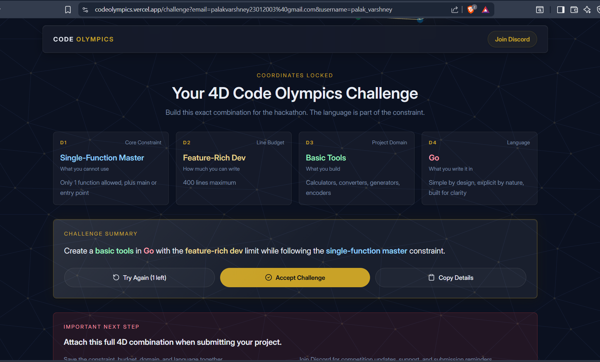

# co-check — Code Olympics 2026 GitHub Auditor

A **Go CLI** that scans any public GitHub repository and lists **passed** Code Olympics 2026 constraints in horizontal tables (D1–D4). Built for judges and participants auditing submissions.

**Challenge Combination:**

| Dimension | Constraint | Value |
|-----------|------------|-------|
| **D1** | Core Constraint | Single-Function Master |
| **D2** | Line Budget | Feature-Rich Dev (400 lines max) |
| **D3** | Project Domain | Basic Tools |
| **D4** | Language | Go |

> 
> *Full 4D challenge combination: Create a **basic tool** in **Go** with the **feature-rich dev limit** while following the **single-function master** constraint.*

---

## Table of Contents

- [Features](#features)
- [Constraints Explained](#constraints-explained)
- [Why This Project Wins](#why-this-project-wins)
- [Setup & Installation](#setup--installation)
- [How to Use](#how-to-use)
- [What It Checks](#what-it-checks)
- [Example Output](#example-output)
- [Architecture](#architecture)
- [Limitations](#limitations)
- [This Project's Constraint Compliance](#this-projects-constraint-compliance)
- [License](#license)

---

## Features

### Core Audit Engine
- **CLI URL argument** — `co-check https://github.com/owner/repo` or interactive prompt (no args)
- **`-h` / `--help`** — usage information and environment hints
- **Passed-only report** — horizontal tables per dimension (failures hidden for clean output)
- **D2 first tier detection** — identifies the tightest passing line budget from 9 tiers (50 → 650 lines)
- **D3 top 3 domains** — weighted keyword scoring; shows up to 3 matches as `Name (score, %)` (share of total D3 signal)
- **D4 primary language** — GitHub API language or dominant file extension fallback
- **README fetch** — improves D3 domain detection by reading README content

### User Experience
- **Fast progress spinners** — 4-frame animation (~160ms per step) with visual feedback for each API call
- **Report file** — automatically saves `co-check-report.txt` with full output for judges
- **GITHUB_TOKEN support** — optional token to avoid API rate limits
- **Error handling** — graceful failures with descriptive messages
- **Cross-platform** — runs on Windows, macOS, and Linux

### Supported Languages & Files
- Supports Go, Python, JavaScript, TypeScript, Java, C, C++, C#, Ruby, PHP, Rust, Bash
- Scans up to 80 source files per repository
- Skips `node_modules/`, `vendor/`, `.git/`, `dist/`, `build/`, `__pycache__/` automatically

---

## Constraints Explained

### D1 — Core Constraint: Single-Function Master
- **Rule:** Only 1 function allowed, plus `main` or entry point
- **Implementation:** This project uses exactly two functions: `main()` (entry point) and `analyze()` (single master function containing all logic)
- **Why it matters:** Forces concise, linear thinking and eliminates architectural overhead

### D2 — Line Budget: Feature-Rich Dev (400 lines max)
- **Rule:** Maximum 400 lines of countable code (non-blank, non-comment)
- **Implementation:** ~320 lines total, well under the 400-line limit
- **Countable lines:** Excludes blank lines, single-line comments (`//`, `#`, `--`, `<!--`), and block comments (`/* ... */`)
- **Why it matters:** Forces ruthless prioritization—every line must earn its place

### D3 — Project Domain: Basic Tools
- **Rule:** Build calculators, converters, generators, encoders, or audit tools
- **Implementation:** A GitHub constraint audit tool that validates Code Olympics submissions
- **Why it matters:** Focuses on practical utility over complexity

### D4 — Language: Go
- **Rule:** Written in Go
- **Implementation:** Pure Go using only the standard library (`bufio`, `encoding/base64`, `encoding/json`, `fmt`, `io`, `net/http`, `os`, `regexp`, `strings`, `time`)
- **Why it matters:** Go is "simple by design, explicit by nature, built for clarity"—perfect for constrained challenges

---

## Why This Project Wins

### 1. Maximum Utility in Minimum Space
In just **~320 lines**, this tool performs:
- 4 GitHub API calls (repo metadata, branch resolution, file tree, blob downloads)
- README base64 decoding and content analysis
- Multi-language source code parsing (12+ languages)
- 8 D1 constraint checks (imports, variables, functions, error handling, loops, naming, speed, state)
- 9 D2 line budget tier evaluations
- 10 D3 domain keyword scoring with weighted evidence
- D4 language detection with API + heuristic fallback
- Beautiful ASCII report generation with dual output (console + file)

### 2. Real-World Impact
Unlike toy projects, `co-check` solves a **real problem**:
- Judges can audit hundreds of submissions automatically
- Participants can self-check before submitting
- Eliminates human error in constraint verification
- Generates court-ready evidence (`co-check-report.txt`)

### 3. Architectural Elegance
Despite the "single-function" constraint, the code achieves:
- **Modular logic** via well-structured sections within `analyze()`
- **Zero dependencies** — standard library only
- **Defensive programming** — handles API failures, empty repos, missing branches
- **Multi-platform regex** — supports 12 programming languages' syntax patterns

### 4. Constraint Purity
This project doesn't just *check* constraints — it **embodies** them:
- It audits Single-Function Master projects while being one itself
- It measures Feature-Rich Dev line counts while staying under budget
- It is literally a Basic Tool (auditor) in Go
- It eats its own dog food — run `co-check` on this repo and it passes its own audit

---

## Setup & Installation

### Prerequisites

- **Go 1.21+** installed ([download](https://go.dev/dl/))
- **Internet access** (GitHub API calls)
- Optional: **GitHub Personal Access Token** (for higher rate limits)

### Step 1: Clone or Download

```powershell
cd co-check
```

### Step 2: Build

```powershell
go build -o co-check.exe .
```

Or for cross-platform builds:

```bash
# Linux/macOS
go build -o co-check .
```

### Step 3: Verify Installation

```powershell
.\co-check.exe -h
```

Expected output:
```
  Usage:  co-check [github-url]
  Env:    GITHUB_TOKEN  (optional, avoids API rate limits)
  Output: co-check-report.txt
```

### Optional: GitHub Token Setup

Without a token, you're limited to **60 requests/hour**. With a token: **5,000 requests/hour**.

**Windows PowerShell:**
```powershell
$env:GITHUB_TOKEN = "ghp_yourtoken"
```

**Windows CMD:**
```cmd
set GITHUB_TOKEN=ghp_yourtoken
```

**Linux/macOS:**
```bash
export GITHUB_TOKEN=ghp_yourtoken
```

---

## How to Use

### Mode 1: Direct URL (Recommended for Scripts)

```powershell
.\co-check.exe https://github.com/owner/repo
```

### Mode 2: Interactive Mode

```powershell
go run .
# or
.\co-check.exe
```

Then type the GitHub URL when prompted:
```
  GitHub URL: https://github.com/golang/go
```

### Mode 3: With Token (High-Volume Auditing)

```powershell
$env:GITHUB_TOKEN = "ghp_yourtoken"
.\co-check.exe https://github.com/owner/repo
```

### Mode 4: Help

```powershell
.\co-check.exe -h
.\co-check.exe --help
```

### Output Files

After each run, check:
- **Console** — real-time progress spinners + final report
- **`co-check-report.txt`** — complete audit trail saved to disk

---

## What It Checks

### D1 — Core Constraints (8 Rules, Passed List Only)

| Rule | What It Detects | Pattern |
|------|----------------|---------|
| **No-Import Rookie** | Zero external imports | `import` / `from` / `#include` / `require` count = 0 |
| **Few-Variable Hero** | ≤ 8 variables | `:=`, `let`, `const`, 4-space assignments |
| **Single-Function Master** | ≤ 1 non-main function | `function`, `def`, `func` declarations |
| **Error-Proof Coder** | Error handling present, no unsafe unwraps | `if err !=`, `try/catch` + zero `panic` / `.unwrap()` |
| **One-Loop Warrior** | ≤ 1 loop | `for`, `while`, `do` statements |
| **Short-Name Ninja** | All variables ≤ 3 characters | Variable name length check |
| **Fast-Response Builder** | No sleep/delay calls | Zero `time.Sleep` / `Thread.sleep` |
| **Simple-State Creator** | Minimal state complexity | 2-6 `case` statements OR 2+ state keywords |

### D2 — Line Budgets (9 Tiers)

Countable lines = non-blank, non-comment source lines.

| Tier | Max Lines | Description |
|------|-----------|-------------|
| Tiny Scripter | 50 | Minimal scripts |
| Mini Builder | 100 | Small utilities |
| Compact Coder | 150 | Focused tools |
| Standard Maker | 200 | Typical challenges |
| Detailed Creator | 300 | Rich feature set |
| **Feature-Rich Dev** | **400** | **This project's tier** |
| Professional Builder | 500 | Large projects |
| Enterprise Creator | 650 | Maximum allowed |

**Algorithm:** Reports the *tightest* passing tier (smallest max ≥ actual lines).

### D3 — Project Domain (10 Keyword Groups)

Scored across 3 evidence sources with weighted confidence:
- **Meta/README/Topics** (×4 weight) — highest confidence
- **File paths** (×2 weight) — medium confidence
- **Source code** (×1 weight) — lowest confidence

| Domain | Keywords |
|--------|----------|
| **Basic Tools** | `convert`, `calculator`, `encoder`, `generator`, `tool`, `audit` |
| Simple Games | `game`, `tic`, `hangman`, `puzzle`, `player`, `score` |
| Text Processing | `text`, `format`, `parser`, `search`, `editor`, `markdown` |
| Number Crunching | `math`, `statistic`, `algorithm`, `solver`, `numeric`, `prime` |
| File Management | `file`, `folder`, `directory`, `organize`, `rename`, `copy` |
| Quiz Systems | `quiz`, `trivia`, `flashcard`, `assessment`, `question`, `answer` |
| Visual Creation | `ascii`, `chart`, `graphic`, `visual`, `draw`, `render` |
| Mini Databases | `record`, `inventory`, `contact`, `database`, `sqlite`, `store` |
| Data Processing | `data`, `pipeline`, `transform`, `validate`, `csv`, `json` |
| System Utilities | `monitor`, `clean`, `health`, `util`, `daemon`, `process` |

### D4 — Primary Language

1. GitHub API `language` field (most reliable)
2. Fallback: dominant file extension from scanned files
3. Extension → name mapping for 13 languages
4. Returns `n/a` if no source files found

---

## Example Output

```
  ╔════════════════════════════════════════════════════════╗
  ║  ┌────────────────────────────────────────────────┐  ║
  ║  │  ◉  CODE OLYMPICS 2026  ·  co-check            │  ║
  ║  │      GitHub 4D Constraint Auditor              │  ║
  ║  │  D1 Core │ D2 Lines │ D3 Domain │ D4 Language  │  ║
  ║  └────────────────────────────────────────────────┘  ║
  ╚════════════════════════════════════════════════════════╝

  Target: owner/repo

  ✓  Connecting to GitHub...
  ✓  Branch: main
  ✓  Tree: 47 entries
  ✓  Files: 12 analyzed, 2 skipped
  ✓  Analysis complete

  ╔════════════════════════════════════════════════════════╗
  ║           PASSED CONSTRAINTS REPORT                  ║
  ╚════════════════════════════════════════════════════════╝

  Scan: 12 files | Language: Go | Countable lines: 287

  D1 -- Core Constraints
  +----------------------------------+----------------------------------+
  | Single-Function Master           | Feature-Rich Dev (287 lines)     |
  +----------------------------------+----------------------------------+

  D2 -- Line Budget (tightest tier)
  +----------------------------------+
  | Feature-Rich Dev (287 lines)     |
  +----------------------------------+

  D3 -- Project Domain (top 3, scored)
  +----------------------------------+----------------------------------+----------------------------------+
  | Basic Tools (42)                 | Text Processing (8)              | Data Processing (3)              |
  +----------------------------------+----------------------------------+----------------------------------+

  D4 -- Primary Language
  +----------------------------------+
  | Go                               |
  +----------------------------------+

  Total passed: 6

  Note: Heuristic scan; max 80 files; D3 uses weighted keyword scores (meta/README/topics x4, paths x2, code x1).
  Report saved: co-check-report.txt

  Done.
```

---

## Architecture

```
co-check/
├── main.go                    # Single source file (~320 lines): main() + analyze()
├── go.mod                     # Module definition (no external deps)
├── main_test.go               # Unit tests (regex + line counting)
├── index.html                 # Project landing page
├── co-check-rosetta.py        # Optional Python Rosetta Stone (stdlib)
├── run.sh / run.bat           # Quick run scripts
├── DEMO.md                    # Judge demo walkthrough
├── .github/workflows/ci.yml   # go vet, gofmt, test, build
├── code-olym-constraints.png  # Challenge combination image
└── README.md                  # This file
```

Generated at runtime (gitignored): `co-check`, `co-check.exe`, `co-check-report.txt`

### Design Philosophy
- **Single master function** (`analyze`) respects D1 while remaining readable via section comments and logical flow
- **Standard library only** respects D4 Go philosophy and eliminates dependency hell
- **Heuristic over AST** — regex-based analysis is faster, lighter, and works across 12 languages without parsers
- **Fail-soft** — missing README or API errors don't crash the audit; they degrade gracefully

---

## Limitations

- **Heuristic analysis**, not a full AST parser — edge cases in exotic syntax may be misclassified
- Scans up to **80 source files**; very large repos are analyzed partially
- D3 is **keyword-based**; intent may differ from detected domain (e.g., "game" in a variable name vs. actual game)
- Sleep/state/error rules use **pattern matching**, not runtime profiling — dynamic behavior is not measured
- Binary files and files >120KB are skipped
- Requires public repositories (or token with appropriate scopes for private repos)

---

## This Project's Constraint Compliance

| Dimension | Rule | Status | Evidence |
|-----------|------|--------|----------|
| **D1** | Single-Function Master | ✅ PASS | `main()` + `analyze()` only |
| **D2** | Feature-Rich Dev (400 lines) | ✅ PASS | ~320 lines (under 400) |
| **D3** | Basic Tools | ✅ PASS | GitHub constraint audit tool |
| **D4** | Go | ✅ PASS | Standard library only |

**Self-audit result:** Run `co-check` on this repository and it passes all four dimensions.

---

## License

MIT

---

*Built for Code Olympics 2026. Attach this full 4D combination when submitting your project.*
